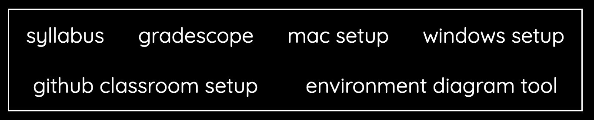

# CSCI 134 Webpage

## Content Changes

All content is specified by `builder/src/components/csci134.json`.

### Info Bar

Each link on the "info bar", i.e. this:



is represented by a datum in the following format:

    {
        "id": "info-K",
        "title": "NAME FOR THE LINK",
        "locked": false/true,
        "link": "PUT URL HERE"
    }

### Schedule

Each week in the schedule is represented by a datum in the following format:

    {
        "id": "week-NUM",
        "week": NUM,
        "lab": LAB-DATUM,
        "mon": [MONDAY-DATA],
        "wed": [WEDNESDAY-DATA],
        "fri": [FRIDAY-DATA]
    }

where the LAB-DATUM has the following format:

    {
        "id": "lab-NUM",
        "title": "NAME OF THE LAB",
        "due": "DUE DATE OF THE LAB",
        "release": "RELEASE DATE OF THE LAB",
        "link": "URL FOR THE LAB STARTER"
    }

and each datum in the {MONDAY, WEDNESDAY, FRIDAY}-DATA has the following format:

    {
        "type": "activity/kahoot/holiday/lecture/jlecture/quiz",
        "title": "NAME OF THE CONTENT",
        "release": "RELEASE DATE",
        "link": "URL FOR THE CONTENT"
    },

("jlecture" stands for "Jeannie lecture")


## Site Deployment

1. If you don't have Node/JS installed, type the following on a Mac terminal:
```
brew update
brew install node
```
2. Navigate to the "builder" directory.
3. The first time you deploy (you don't have to do this on subsequent deployments), type ```npm install```.
4. You can preview your changes locally by typing ```npm run dev``` and loading ```localhost:5173``` (or whatever it tells you) in a browser.
5. To deploy, type ```npm run deploy```, then add and commit all changes, then push to the repo.


