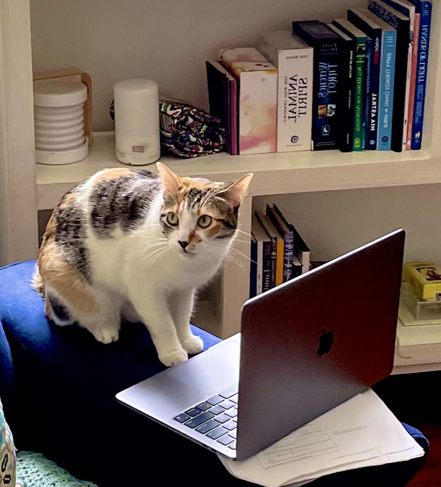
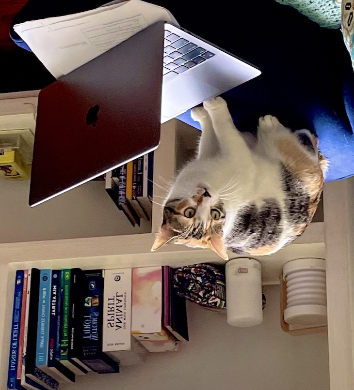
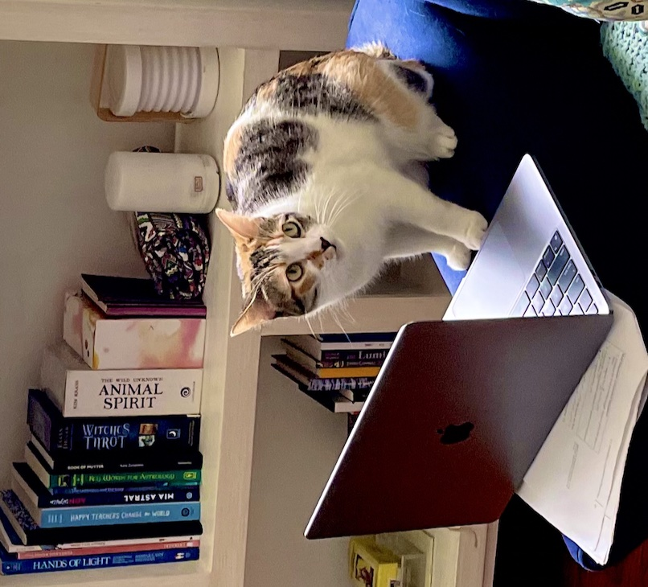
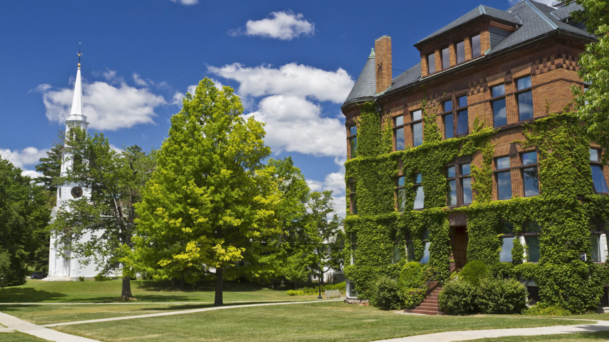
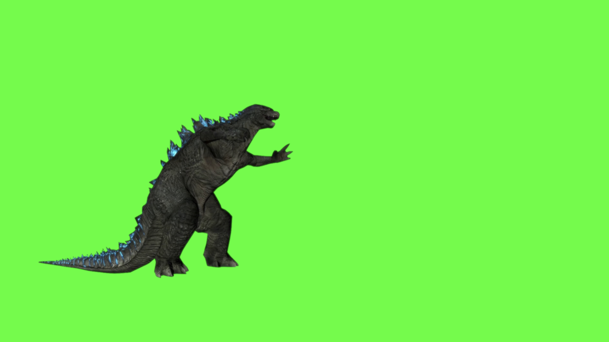

# Lab: Image Shop

```{admonition} Objectives
In this lab we will look at how to manipulate images using Python. In doing so, you will gain experience with the following:

- lists, and lists of lists, and lists of lists of lists
- for statements
- if statements
```

## Getting Started

Before you begin, clone this week's repository in the usual manner:

```bash
git clone https://evolene.cs.williams.edu/cs134-labs/23xyz3/lab0x.git ~/cs134/lab0x
```

where your CS username replaces `23xyz3`.

We will be working with images stored as JPEG files, which typically have the suffix ```.jpg```. Several example images are stored in the ```images``` directory of the starter code.

## Part 0: Configuring your machine for the Python Imaging Library (PIL)

**IMPORTANT:** Before starting this lab, you will need to have either installed `pillow` on your personal computer (as described in the setup guides on the course website), or you will need to setup and use a virtual environment.  The lab machines are already configured for you.

## Part 1: Understanding Images

1. **Display some images.** In ```imageutil.py```, we've provided two functions ```read_image``` and ```show_image``` that respectively allow us to read images from a file and then display that image in a separate window. Try out these functions in iPython on some of the image files contained in the ```images``` directory. For example:

    ```python
    from imageutil import read_image, show_image
    img = read_image('images/williams.jpg')
    show_image(img)
    ```

2. **Understand how images are stored.** Images are represented as a grid of tiny squares called "pixels", short for "picture elements". Below we show two images that are each 5 pixels wide and 5 pixels high.
    
A pixel can be specified in two different ways, depending on whether we want a grayscale image (left) or a color image (right). If we simply want a grayscale image, then we can specify a pixel using **a single integer between 0 and 255**, which tells the computer how light the pixel should be: 0 is the darkest shade of gray (i.e. black), while 255 is the lightest shade of gray (i.e. white). If we want a color image, then we specify **a list of three integers between 0 and 255**, respectively specifying the redness, greenness, and blueness of the pixel. For instance, to make a purple pixel in the rightmost image above, we specify the pixel using the list ```[100, 0, 100]```, i.e. 100 units of red, 0 units of green, and 100 units of blue. In ```imageshop.py```, the functions ```letter_t``` and ```williams_w``` produce the images shown above. Note that each grid of pixels is a list of lists (because color pixels are themselves lists, the color
image is a list of lists of lists!). You can display the images in iPython (note: you'll likely have to zoom in to see the images, since they'll be very small):

    ```python
    from imageutil import show_image
    from imageshop import letter_t, williams_w
    img = letter_t()
    show_image(img)
    img2 = williams_w()
    show_image(img2)
    ```

3. **Create an all black image.** Implement the function `zeroes` in `imageshop.py`. It should take two arguments:
- `num_rows`: the number of rows of pixels in the image
- `num_cols`: the number of columns of pixels in the image
It should return an all-black image with the specified number of rows and columns. In other words, every pixel should have the value zero.

## Part 2: Manipulating Images

1. **Flip an image horizontally.** Implement the function `flip_horizontal` in `imageshop.py`. It should take an image as its sole argument, and return a new image that looks like the original image flipped horizontally. For instance, if we type ```show_image(flip_horizontal(read_image("images/cat.jpg")))``` into iPython, then we should see the following flipped image (in the original image, the cat is looking in the other direction and the book titles aren't mirrored):

    

2. **Flip an image vertically.** Now flip the image vertically! Implement the function `flip_vertical` in `imageshop.py`. Again, it should take an image as its sole argument, and return a new image that looks like the original image flipped vertically. For instance, if we type ```show_image(flip_vertical(read_image("images/cat.jpg")))``` into iPython, then we should see the following flipped image:

    

3. **Rotate an image 90 degrees to the left (counterclockwise).** Now rotate the image 90 degrees to the left! Implement the function `rotate_left` in `imageshop.py`. Again, it should take an image as its sole argument, and return a new image that looks like the original image rotated 90 degrees counterclockwise. For instance, if we type ```show_image(rotate_left(read_image("images/williams.jpg")))``` into iPython, then we should see the following rotated image:

   
   
**Hint**: observe that the rotated image might not have the same dimensions as the input image. One strategy is to use the ```zeroes``` function to first initialize an image of the correct size, and then modify the pixels of that image.

## Part 3: Movie Magic!!

**Implement "green screen" technology.** Implement the function `green_screen` that takes two images as arguments: ```background``` and ```foreground```. The background image is just any ordinary JPG, like ```images/williams.jpg```:

    

The foreground image should be a "green screen" image like ```images/godzilla.jpg```:

    

The call ```green_screen(background, foreground)``` should return the non-green component of the foreground image, superimposed upon the background image, like so:

    

To resulting image should be a new image with the same dimensions as the background image. In order to create it, you need to go through the pixels of the background and foreground images in parallel. If the foreground pixel at a particular grid location is green (check this by establishing whether the pixel's greenness is greater than 2 * its redness and also greater than 2 * its blueness), then use the value of the background pixel in the new image. Otherwise, use the value of the foreground pixel.

**Note:** The background and foreground images might not be same size. Since the resulting image has the same dimensions as the background image, just use the value of the background pixel whenever there isn't a corresponding foreground pixel.


## Optional Extension: Convolution

Image convolution is the process of manipulating images by averaging each pixel with its neighbors. Each pixel of the new image is a weighted average of itself and its neighbors, as shown below:

    

Above, the weights are the variables a-i, while the pixel values are the variables r-z. Different weights give us different effects. For instance, we can blur an image using uniform weights of 1/9:

    

Or we can perform "edge detection" using the following weights: 

    

Implement the function ```convolve``` which takes two arguments:
- ```image``` is the image we want to manipulate (i.e. a list of lists. Assume that this image is grayscale. You can load any JPEG image as a grayscale image using the function ```read_image_as_grayscale```.)
- ```kernel``` are the nine weights (each weight is a ```float``` or an ``int```), represented as a 3x3 grid, i.e. a list of 3 lists, each of length 3.

It should return a new image that corresponds to the original image convolved using the specified weights. If the original image has dimension MxN, then the returned image should have dimension (M-2)x(N-2), because the pixels on the boundary of the original image do not have eight neighbors and thus cannot be processed.

Once completed, you should be able to reproduce the above images by typing the following into iPython:

```python
    from imageutil import read_image_as_grayscale, show_image
    from imageshop import convolve
    img = read_image_as_grayscale('images/animal.jpg')
    blurred = convolve(img, [[1/9, 1/9, 1/9],
                             [1/9, 1/9, 1/9],
                             [1/9, 1/9, 1/9]])
    show_image(blurred)
    img = read_image_as_grayscale('images/cat.jpg')
    edges = convolve(img, [[0, -1, 0],
                           [-1, 4, -1],
                           [0, -1, 0]])
    show_image(edges)
```


## Submitting your work

When you're finished, commit and push your work to the server as in previous labs. 

Functionality and programming style are important, just as both the content and the writing style are important when writing an essay.  Make sure your variables are named well, and your use of comments, white space, and line breaks promote readability.  We expect to see code that makes your logic as clear and easy to follow as possible. [](../../docs/style-guide.md) is available on the course website to help you with stylistic decisions.

Do not forget to add, commit, and push your work as it progresses!  Test your code often to simplify debugging.

## Acknowledgments

This lab was adapted from a project created by Eric Roberts, Professor Emeritus of Computer Science at Stanford University.
